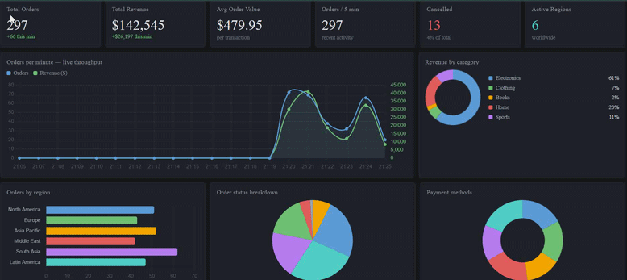

# Real-Time E-Commerce Data Pipeline

> **Stack:** Apache Kafka · Python · PostgreSQL · Grafana · Docker Compose

A production-style real-time data pipeline that Simulates, streams, processes, and visualizes live e-commerce order transactions. demonstrating event-driven architecture, stream processing, and real-time analytics dashboarding.


---

## Architecture

```
┌─────────────┐     Kafka Topic      ┌─────────────┐     INSERT      ┌─────────────┐
│  Producer   │ ──────────────────▶  │  Consumer   │ ─────────────▶  │ PostgreSQL  │
│ (Fake Orders│     ecommerce-orders │ (Transform  │                 │  (Storage + │
│  Generator) │                      │  + Persist) │                 │   Views)    │
└─────────────┘                      └─────────────┘                 └──────┬──────┘
                                                                            │
                                                                     ┌──────▼──────┐
                                                                     │   Grafana   │
                                                                     │  Dashboard  │
                                                                     │  (Live viz) │
                                                                     └─────────────┘
```

**Components:**
- **Producer** — Generates realistic e-commerce orders (products, categories, regions, payment methods) and publishes to Kafka at a configurable rate
- **Kafka** — Decouples producer and consumer; handles high-throughput message streaming with guaranteed delivery
- **Consumer** — Reads from Kafka, validates/transforms records, and batch-inserts into PostgreSQL
- **PostgreSQL** — Persists all orders with indexed columns and pre-built views for analytics queries
- **Grafana** — Auto-provisioned dashboard with 12 panels showing live KPIs, trends, and breakdowns

---

##  Dashboard Panels

| Panel | Type | Description |
|-------|------|-------------|
| Total Orders | Stat | Running count of all orders |
| Total Revenue | Stat | Sum of all transaction values |
| Avg Order Value | Stat | Mean transaction size |
| Orders Last 5 Min | Stat | Recency indicator |
| Cancelled Orders | Stat | Cancellation tracking |
| Active Regions | Stat | Geographic spread |
| Orders Per Minute | Time Series | Live throughput graph |
| Revenue by Category | Donut Chart | Electronics, Clothing, Books, etc. |
| Orders by Region | Bar Chart | Geographic distribution |
| Order Status Breakdown | Pie Chart | pending/confirmed/shipped/delivered |
| Payment Methods | Donut Chart | Credit Card, PayPal, Apple Pay, etc. |
| Recent Orders | Live Table | Last 20 orders with all fields |

---

## Quick Start — Docker (Recommended)

### Prerequisites
- [Docker Desktop](https://www.docker.com/products/docker-desktop/) installed and running

### Run everything in one command

```bash
git clone https://github.com/EN-AenaHabib/realtime-pipeline.git
cd realtime-pipeline
docker compose up --build
```

Wait ~30 seconds for all services to initialize, then open:

| Service | URL | Credentials |
|---------|-----|-------------|
| **Grafana Dashboard** | http://localhost:3000 | admin / admin |
| **PostgreSQL** | localhost:5432 | pipeline / pipeline123 |
| **Kafka** | localhost:9092 | — |

> The dashboard auto-loads. Go to **Dashboards → E-Commerce Real-Time Pipeline**.

### Stop everything
```bash
docker compose down
# To also remove volumes (wipe data):
docker compose down -v
```

---

## 🔧 Manual Setup (Without Docker)

### Prerequisites
- Python 3.9+
- Apache Kafka + Zookeeper running locally
- PostgreSQL 13+ running locally

### 1. Start Kafka (if not running)
```bash
# Download Kafka from https://kafka.apache.org/downloads
cd kafka_2.13-3.6.0
bin/zookeeper-server-start.sh config/zookeeper.properties &
bin/kafka-server-start.sh config/server.properties &
```

### 2. Set up PostgreSQL
```bash
psql -U postgres -c "CREATE DATABASE ecommerce;"
psql -U postgres -c "CREATE USER pipeline WITH PASSWORD 'pipeline123';"
psql -U postgres -c "GRANT ALL PRIVILEGES ON DATABASE ecommerce TO pipeline;"
psql -U pipeline -d ecommerce -f postgres/init/01_schema.sql
```

### 3. Run the Producer
```bash
cd producer
pip install -r requirements.txt
KAFKA_BROKER=localhost:9092 TOPIC_NAME=ecommerce-orders python producer.py
```

### 4. Run the Consumer
```bash
cd consumer
pip install -r requirements.txt
KAFKA_BROKER=localhost:9092 \
TOPIC_NAME=ecommerce-orders \
POSTGRES_HOST=localhost \
POSTGRES_USER=pipeline \
POSTGRES_PASSWORD=pipeline123 \
POSTGRES_DB=ecommerce \
python consumer.py
```

### 5. Set up Grafana
1. Install Grafana: https://grafana.com/grafana/download
2. Start Grafana: `sudo systemctl start grafana-server`
3. Open http://localhost:3000 (admin/admin)
4. Add PostgreSQL datasource (host: localhost:5432, db: ecommerce, user: pipeline)
5. Import `dashboard/provisioning/dashboards/ecommerce.json`

---

## ⚙️ Configuration

| Environment Variable | Default | Description |
|---------------------|---------|-------------|
| `KAFKA_BROKER` | `localhost:9092` | Kafka broker address |
| `TOPIC_NAME` | `ecommerce-orders` | Kafka topic name |
| `ORDERS_PER_SECOND` | `2` | Producer throughput rate |
| `POSTGRES_HOST` | `localhost` | PostgreSQL host |
| `POSTGRES_USER` | `pipeline` | DB username |
| `POSTGRES_PASSWORD` | `pipeline123` | DB password |
| `POSTGRES_DB` | `ecommerce` | Database name |

---

## 📁 Project Structure

```
realtime-pipeline/
├── docker-compose.yml          # Full stack orchestration
├── producer/
│   ├── producer.py             # Order event generator
│   ├── Dockerfile
│   └── requirements.txt
├── consumer/
│   ├── consumer.py             # Kafka → PostgreSQL processor
│   ├── Dockerfile
│   └── requirements.txt
├── postgres/
│   └── init/
│       └── 01_schema.sql       # Tables, indexes, views
└── dashboard/
    └── provisioning/
        ├── datasources/
        │   └── postgres.yml    # Auto-configure PostgreSQL in Grafana
        └── dashboards/
            ├── dashboard.yml   # Dashboard provider config
            └── ecommerce.json  # Full Grafana dashboard definition
```

---

## 🧠 Key Concepts Demonstrated

- **Event-driven architecture** — Producer and consumer fully decoupled via Kafka
- **Fault tolerance** — Consumer uses batch processing with retry logic; producer uses `acks=all`
- **Stream processing** — Real-time ingestion with configurable throughput
- **Data modeling** — Normalized schema with indexes optimized for time-series and categorical queries
- **Analytics views** — Pre-built PostgreSQL views for revenue, status, region, and product analytics
- **Auto-provisioning** — Grafana datasource and dashboard configured via YAML/JSON (no manual setup)

---

## 👩‍💻 Author

**Aena Habib** — AI Engineer  
[GitHub](https://github.com/EN-AenaHabib) · [LinkedIn](https://www.linkedin.com/in/aena-habib-260947354/) · [Kaggle](https://www.kaggle.com/aenahabib) · [HuggingFace](https://huggingface.co/Aenpi)

---

## 📄 License

MIT License — free to use, modify, and distribute.
=======
# real-time-ecommerce-order-transaction-system
Event-driven pipeline for processing e-commerce orders and transactions with real-time analytics dashboards.

